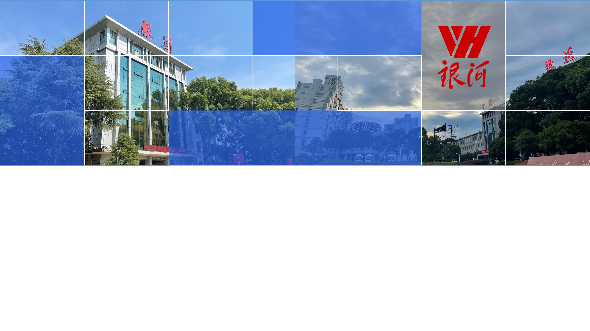

##### 计算机体系结构（2024年春）

<!-- _class: title -->

# 第一讲：计算机体系结构的基本概念

和子煦
fakeaddress@nudt.edu.cn

---

# 课程介绍：《计算机体系结构》课

<!-- _class: content -->

- 主要学习现代计算机的组成和实现，并使用定量的方法对计算机系统的性能进行分析和评价
    - 综合了计算机组成原理、编译、操作系统和计算机网络的许多内容
    - 也涵盖其他内容，例如现代计算机设计上的安全问题和计算机体系结构这一领域新兴进展
- 这门课程将要回答
    - 一个好的计算机系统是如何工作的？
    - 计算机体系结构的基本概念、设计思想和实现技术——专业化的认知训练
    - 精确描述典型的计算机结构、工作原理和计算机设计中的关键技术
    - 设计方案定量地采集和分析数据，并使用或构建专业的工具完成这一工作

---
